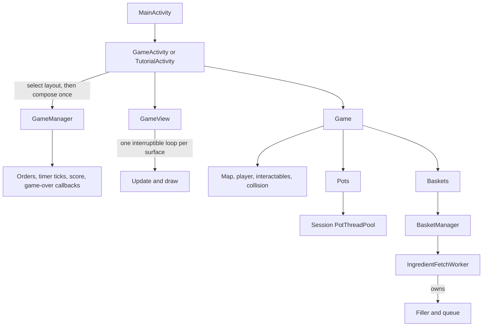
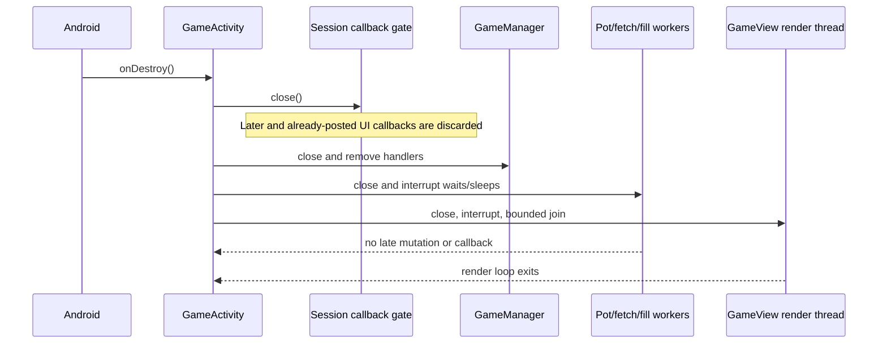

# Runtime architecture

Purpose: make structural changes to the Android app, custom game engine, map, rendering, threading, or UI wiring. For observable game rules, see [gameplay.md](gameplay.md).

## Runtime shape

`GameActivity` selects the layout before composing its session. `TutorialActivity` overrides the layout choice, so the superclass composes directly against the tutorial layout and does not create a hidden game first. A one-shot composition guard protects manager, render binding, pot pool, and fetch/fill ownership. Android XML layouts are overlays around `GameView`; canvas objects are not Android views.

## Map and rendering

- Runtime map: `android/app/src/main/assets/map.tmj`; authoring counterpart: `Tiled stuff/map.tmj`. The project directory naming decision is recorded in [ADR 0005](decisions/0005-android-project-directory.md).
- `Game.loadMapFromJson()` reads the `Floor` tile layer and `Interactables` object layer, finds spawn tile GID `2`, and instantiates objects from their `type` property.
- It maps only the listed external tilesets to runtime sprites in code. Map object properties provide each interactable's sprites and pot settings.
- `Game.draw()` paints floor, interactables, then player onto the canvas. `GameView` runs the update/draw loop; `Game.getSleepTime()` targets 16 ms.
- Coordinates are pixels but gameplay assumes `Game.TILE_SIZE == 120`, `MAP_WIDTH == 20`, and `MAP_HEIGHT == 9`. Map resizing requires changing this coupling and testing multiple display sizes.

## State owners

| State | Owner | Notes |
| --- | --- | --- |
| Player location/motion and held item | `Player`, shared `PlayerInventory` | Moves in tile increments; collision is in `Game.canMoveTo`. |
| Map objects | `Game` | Lists are built once from the map. |
| Pot contents/state | `Pot`, `PotFunctions` | Cooking runs on a shared executor. |
| Basket contents / available ingredients | `BasketManager`, `IngredientFetchWorker` | Fetcher uses a producer/consumer queue to refill baskets. |
| Orders, score, failures | `GameManager`, `OrderCountdown`, `CompletionScoring`, `FailureCounter` | Main-thread handlers schedule spawning and 16-ms ticks. Order active-time countdown, current streak scoring, and the three-failure threshold are isolated as deterministic rules used by the manager. |
| Pause reasons / active time | Session `PauseState`, coordinated by `GameManager` | Manual menu, background, and tutorial pauses are independent; terminal and closed are final. Worker durations consume active time only. |
| Activity/HUD state | `GameActivity` | Receives callbacks and updates Android views. |
| Save compatibility and snapshots | `GameVersionPolicy`, `GameSaveSnapshot`, `GameSaveParser`, `PrefsHelper` | Same-major saves are parsed before application and again after synchronous persistence; failures remain behind the `LOAD` pause until the player acknowledges and the activity returns to the menu. |
| Session workers | Owning activity session | Activity close stops manager handlers, interrupts the pot pool and fetcher, and the fetcher closes its filler and queue. |

## Concurrency boundaries

`GameManager` handlers run on the main looper, while `PotThreadPool`, `IngredientFetchWorker`, and `IngredientBasketFiller` use executors. A session `PauseState` serializes pause transitions with gameplay mutations and callbacks and supplies active-time waits to cooking and ingredient exchange/filling, so work retains its remaining duration across pause. The manager keeps the remaining order-spawn delay and pauses each active order timer. `Game` and `Player` reject gameplay input and stop movement updates whenever the shared session state is paused or terminal, with one explicit tutorial-only movement allowance. That allowance never makes the gameplay session running and is blocked by manual pause, backgrounding, terminal state, or closure. Background resume clears only the background reason; a manual menu or tutorial pause remains in effect. The tutorial installs its pause before manager startup, so no hidden order schedule is created.

Closing an owner is idempotent, prevents later submissions, removes manager callbacks, and interrupts waits and queue waits. The fetcher owns and closes its filler; queue closure wakes both producer and consumer waiters. Interrupted cooking exits before producing food or reporting progress. The pot receives a narrow `PotFunctions.PotListener`, not an Activity cast. `GameManager` rejects repeated game-over finalization, and an Activity-side `FinalizationGate` ensures the dialog, local statistics update, and saved-run clear are each applied once.

Worker UI callbacks post through a session gate and check it again when the main-thread runnable executes. A callback already in the message queue is therefore discarded after activity destruction. Held-direction callbacks are tracked per control and all removed on pause, stop, and destruction; releasing one of two held controls leaves the other active.

The render thread reads safely published `Game` and run-state references, tolerates an uninitialized game, and exits when interrupted. Surface destruction interrupts it and joins for at most 300 ms outside game-state locks. A new surface does not start a second loop while the prior thread is still alive; if that thread exits after the new surface is available, it starts the replacement loop. Activity destruction permanently closes the renderer. Garbage-collection timing is not used as evidence of worker cleanup.

On 2026-10-03, `testDebugUnitTest`, `assembleDebug`, and `assembleDebugAndroidTest` passed after these lifecycle changes. `connectedDebugAndroidTest` passed 5/5 tests on `emulator-5556` (Medium_Phone_API_36, API 36). It verified two tutorial entry/exit cycles with one composition and manager closure, bounded activity teardown during a live ingredient fetch and live pot cook, no late ingredient/order/UI changes after closure, and five actual `GameView` surface detach/reattach cycles with one render loop at a time. Each surface teardown completed within the test's two-second allowance; activity teardown closed all session owners within five seconds.

On 2026-10-04, the integration suite passed 14/14 tests on `emulator-5556` (Medium_Phone_API_36, API 36). It repeats tutorial entry/exit five times, preserves the five-surface recreation check, and drives actual three-order expiries in both fresh and restored runs. `GameplayRulesTest` independently covers the pure recipe multiset, order countdown, scoring streak, and failure threshold seams. The automated run is supplemented by the visible acceptance evidence and explicit successful-submission capture limitation in [development.md](development.md).

After the integration PR was restacked on the two-slot save branch on 2026-10-05, the combined suite passed 19/19 device tests on `emulator-5554` (Medium_Phone_API_36, API 36). Terminal save restoration now enters the same `FailureCounter` terminal seam used by live order expiry before the one-shot game-over callback runs; this avoids a second, divergent failure-count path.

## High-risk seams

- The map's external TSX paths/names, JSON object properties, Java switch cases, and asset filenames are a single integration seam.
- `GameActivity` serializes directly against object ordering (tables, pots, baskets); map reordering can silently remap saved state.
- Saves use stable item and recipe identities but still bind table and pot records to their current map ordering; map object reordering requires a major version bump or explicit migration.
- Session ownership and closure span the manager, renderer, cooking pool, fetcher, and its filler; future asynchronous owners must join this close boundary.
- Recipe submission still matches player-facing names, while persistence uses stable recipe IDs and derives current display names; removing or reinterpreting an ID requires a save-compatibility major bump.

## Source navigation

| Concern | Primary files |
| --- | --- |
| Activity navigation/menu | `MainActivity.java`, `BaseActivity.java`, `AndroidManifest.xml` |
| Game composition/HUD/input/save | `GameActivity.java`, `activity_game.xml` |
| Canvas loop/map/collision | `GameView.java`, `Game.java`, `Player.java`, `Interactable.java` |
| Orders/time/score | `GameManager.java`, `Order.java`, `OrderAdapter.java` |
| Cooking and objects | `Pot*.java`, `Basket*.java`, `Table.java`, `SubmissionZone.java`, `RubbishBin.java` |
