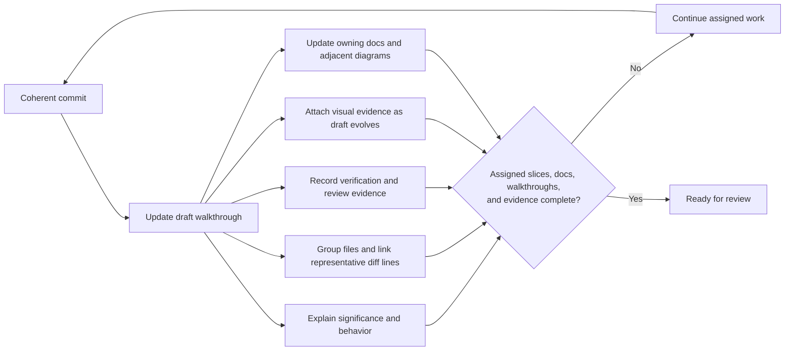

# Documentation maintenance

Purpose: keep this documentation accurate without creating a parallel, bloated copy of the codebase.

## Deterministic owner lookup and update

1. Name the changed contract in concrete terms (behavior, runtime structure, build/test workflow, persistence, assets/maps, product direction, or agent workflow).
2. Find its owner in the ownership map below. Start with the route in `docs/README.md`; follow its source links and inspect the relevant code/configuration. When more than one contract changes, update each owning page and keep shared facts in only one place.
3. Edit the owning page where its current explanation lives. Update prose and its adjacent diagram together whenever the contract is depicted. A diagram used in a commit or PR walkthrough is review evidence, not the canonical copy: before the PR is ready, move its maintained behavior into the owning page and keep that version current. If no page owns the complete subject, create one focused page, add a row to the ownership map, and route to it from `docs/README.md`.
4. Correct or remove superseded statements; do not preserve stale behavior as a dated layer. Link to source for detailed APIs/configuration instead of duplicating them.
5. Update `docs/README.md` when a page is created, its purpose changes, or a useful route/diagram index changes. Update `AGENTS.md` only for agent-operating rules.
6. Check each claim and diagram against current source/configuration, verify Mermaid syntax and labels, and inspect links. The handoff records the owner pages, diagrams changed (or why none helps), and checks performed.

## Completion criteria

Documentation work is complete only when the owning prose matches current code/configuration; every changed depicted flow has a matching adjacent diagram; there are no contradictory or stale claims; navigation reaches the owner and its important visual explanation; and the handoff states verification and any unresolved limitation.

## PR walkthrough and evidence loop

Keep the draft reviewable as each coherent commit lands. The commit walkthrough explains the player/system significance, groups related files by behavior, and includes a concise scenario or diagram when it clarifies the behavior, representative changed-line links, and verification/review evidence. Attach useful visual evidence while the draft evolves. Finalize the PR only when its assigned slices, documentation, walkthroughs, and required automated, manual, and visual evidence are complete or explicitly unavailable; later work in another PR does not hold this one in draft. See the full delivery contract in [AGENTS.md](../AGENTS.md).

## Diagram policy

Use Mermaid in Markdown so diagrams remain reviewable, searchable, and versioned beside the text they explain. A diagram complements the prose; the owning page remains the single source of truth, and both must change together when their contract changes.

Choose the diagram that makes the relationship easiest to understand:

| Subject | Preferred diagram |
| --- | --- |
| Activities, modules, workers, external services, and ownership | Architecture/component flowchart |
| Calls, callbacks, lifecycle events, synchronization, and failure handling | Sequence diagram |
| Pause, session, game, pot, order, or UI lifecycle | State diagram |
| Relational tables and keys | Entity-relationship diagram |
| Firestore or another NoSQL store | Document-model diagram showing collection/document paths, nested maps or subcollections, ownership, references, and cardinality |
| A branching user or system process | Flowchart |

Add a diagram whenever one of these relationships is introduced or materially changed, and whenever it can replace a difficult paragraph or make an idea immediately scannable. Keep it close to the relevant explanation, label current behavior separately from proposed behavior, and show only details needed for the documented contract. Prefer several focused diagrams over one unreadable system map. Do not include secrets, tokens, emails, real UIDs, or copied Firebase configuration.

Verify that Mermaid renders on GitHub and that every node, transition, field group, and label agrees with the source and surrounding prose. A documentation or PR update is incomplete when it changes a depicted contract without updating its diagram. If no diagram would improve understanding, say why in the PR evidence instead of adding decoration.

## Ownership map

| Change | Update |
| --- | --- |
| Gameplay rule, recipes, scoring, interaction, tutorial claim | `gameplay.md` |
| Activity wiring, engine, map, assets, threads, structural seam | `architecture.md` |
| Build, SDK/toolchain, commands, test suite, manual test procedure | `development.md` |
| Saves, preferences, sign-in, Firebase, cloud schema | `persistence.md` |
| Assets and the authored/runtime asset boundary | `assets.md` |
| Product audience, platform scope, online/offline boundary | `product.md` and `direction.md` |
| Product priority, accepted limitation, planned feature | `roadmap.md` |
| Material product or technical decision | `decisions/README.md` and one focused ADR |
| Documentation route, ownership, or maintenance workflow | `docs/README.md` and `doc-maintenance.md` |
| Agent workflow or repository guardrail | `AGENTS.md` |

Write links to source files rather than duplicating long APIs or configurations. If a claim cannot be kept current, delete it or replace it with a pointer to its source of truth.
