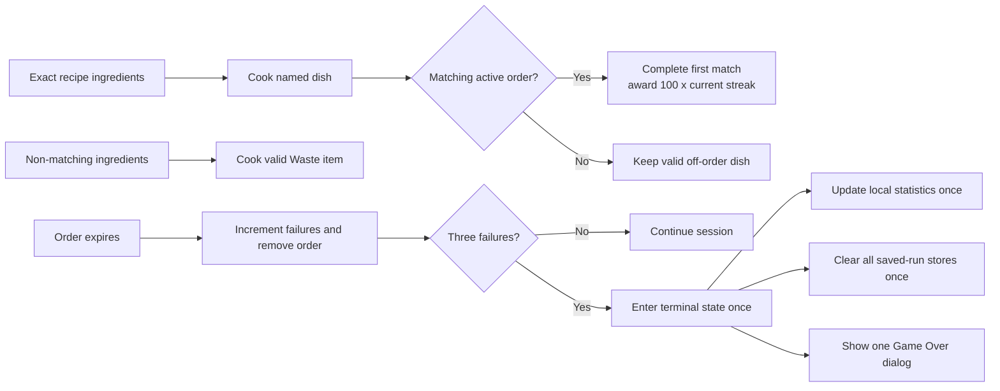
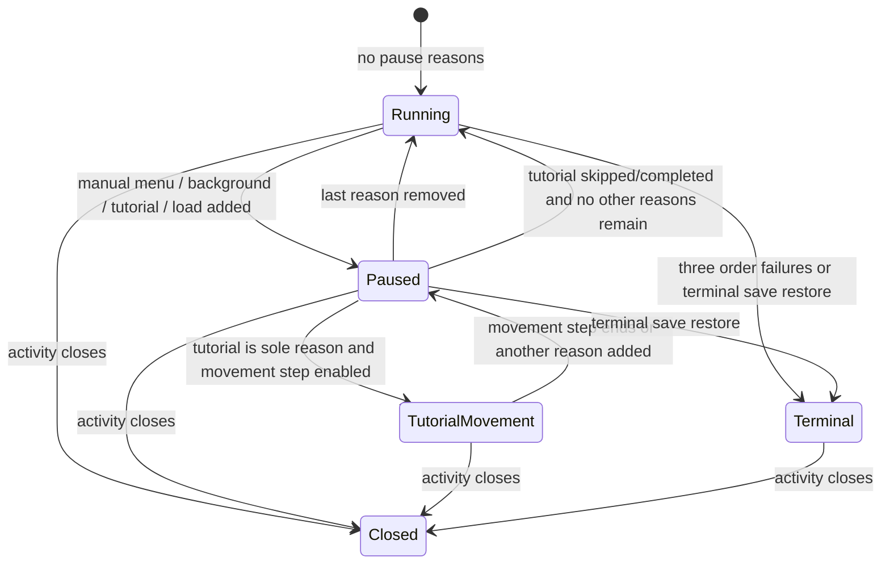

# Gameplay reference

Purpose: change rules, interactions, HUD, recipes, scoring, tutorial wording, or balance without first tracing the whole application. For object construction and rendering, see [architecture.md](architecture.md).

## Player loop

1. `GameManager` spawns an order every 5–13 seconds, up to five active orders. Each random order lasts 60–120 seconds.
2. The player selects/swaps the ingredient set shown in baskets, moves to a basket, and interacts to hold one item.
3. Interacting with an empty pot deposits an ingredient. At three ingredients it cooks for the map-configured time (currently 6 seconds).
4. A matching recipe produces that named dish; a non-matching set produces `Waste`. Collect a finished dish with empty hands.
5. At a submission zone, the first active order with the same recipe name completes. A completion awards `100 × current streak`; the streak rises when consecutive completions are within 10 seconds (the 10-second boundary is included), otherwise the successful completion starts a new streak at 100 points.
6. An expired order increments failures and is removed. Three failures end the game and persist a high score. Game over is terminal: one dialog, local statistics update, and saved-run clear are accepted even if multiple expiry callbacks arrive.

Manual pause, backgrounding, tutorial, and loading are separate pause reasons. Gameplay timers, order spawning/countdown, player movement and interaction, cooking, and ingredient exchange/filling advance only while no pause reason is active. Returning to the foreground removes only the background reason. Manual pause keeps its menu visible, including after backgrounding; Resume clears only the manual pause. Cooking and ingredient exchange continue with their unelapsed in-memory duration after resume. Terminal game over and activity closure are final session states.

Saving is available from the manual pause menu and captures current in-memory work at the player's last fully reached tile without consuming finished pot food. Saves carry the full semantic game version and stable item/recipe identities. Loading validates the complete same-major save before applying it while `LOAD` blocks workers. Active orders and cooking resume from saved remaining time/progress. Incompatible versions and corrupt same-major saves show distinct acknowledged errors, clear the rejected save after acknowledgment, and return to the menu without starting fresh gameplay. A valid terminal snapshot finalizes its result once. `Waste` and dishes without matching active orders remain valid saved items.

The tutorial opens paused before order scheduling. Its existing movement demonstration permits only player movement progression and input; the tutorial pause remains active, so orders, interactions, cooking, ingredient fetching, and filling stay frozen. Backgrounding during the demonstration blocks movement too. Other tutorial steps disable movement. Skip or completion removes the tutorial pause and restores the normal pause control.

## Submission and terminal flow

Valid off-order dishes are intentional: submitting a dish completes only an active order with the same recipe name; otherwise the player keeps the dish. Expiry, not an incorrect dish, increments the failure counter. The third expiry enters the one-shot terminal path used by both live sessions and compatible terminal saves.

## Pause and tutorial lifecycle

`PauseState` tracks independent manual-menu, background, tutorial, and load reasons. The session runs only when none is present. Movement has one narrow exception: `TutorialActivity` enables it during the movement step, and `PauseState` allows it only when tutorial is the sole pause reason. Game over marks the session terminal; activity teardown closes it. Neither terminal nor closed state resumes.

Removing one reason never removes the others: foreground resume clears only `BACKGROUND`, and manual Resume clears only `MANUAL_MENU`. Tutorial completion removes only `TUTORIAL`. The `LOAD` reason is owned by the save/load flow described in [persistence.md](persistence.md#load-decision).

## Recipes and ingredients

`Recipe.getDefaultRecipes()` is the single current recipe catalogue. Ingredient IDs are fixed in `Recipe`: carrot `0`, potato `1`, onion `2`, cabbage `3`, tomato `4`.

| Dish | Exact ingredients |
| --- | --- |
| Tomato Soup | tomato, carrot, onion |
| Veggie Stew | cabbage, potato, carrot |
| Mashed Potato | potato, potato, onion |
| Salad | tomato, potato, carrot |

Recipe matching counts duplicate ingredients. When adding recipes or ingredients, update this catalogue, UI images/table sprites, Tiled properties, and save/load compatibility together.

`GameplayRulesTest` protects exact multiset matching (including two potatoes in Mashed Potato), rejection of wrong, missing, or extra ingredients, one-second order expiry, the inclusive ten-second completion boundary, streak reset, and the three-failure terminal threshold. Device coverage also drives three expiring orders through both fresh and loaded game sessions.

## Interactions

| Object | Behaviour | Source |
| --- | --- | --- |
| Basket | Gives its configured ingredient only when hands are empty. | `Basket.java` |
| Pot | Holds three ingredients; state is `EMPTY → COOKING → DONE`; only empty-handed players collect. | `Pot.java`, `PotFunctions.java` |
| Table | Stores one held item or returns its item to empty hands. | `Table.java` |
| Submission zone | Consumes a cooked dish only when an active order has the same recipe name. | `SubmissionZone.java` |
| Rubbish bin | Discards held items; ten empty interactions display an Easter-egg toast. | `RubbishBin.java` |

## Screens and controls

`MainActivity` opens a normal game, load flow, or `TutorialActivity`; it also owns settings and credits. `GameActivity` overlays the custom `GameView` canvas with orders, score/failure count, inventory, ingredient swapping, interaction, pause/save/settings, and directional touch controls. `TutorialActivity` subclasses `GameActivity` and advances a text-overlay walkthrough; `SimpleTutorialActivity` exists but is not declared in the manifest.

Movement advances by one 120-pixel tile, interpolated in `Player`; an occupied interactable tile blocks movement. Interaction requires orthogonal adjacency. The game is landscape-only and is currently coded around a 20×9 map.

## Balance and rule change checklist

- Order cadence/cap/failure limit/scoring: `GameManager.java`.
- Order duration: `Order.java`.
- Recipe catalogue/matching: `Recipe.java`.
- Pot capacity/timing: `PotFunctions.java` and Tiled pot `cooking_time` properties.
- Tutorial claims: `TutorialActivity.java`.
- Saved-game schema: `GameActivity.java` and [persistence.md](persistence.md).

Test one complete order, one expiry/game-over path, all four interaction outcomes, pause/resume, and save/load after any rule change.
