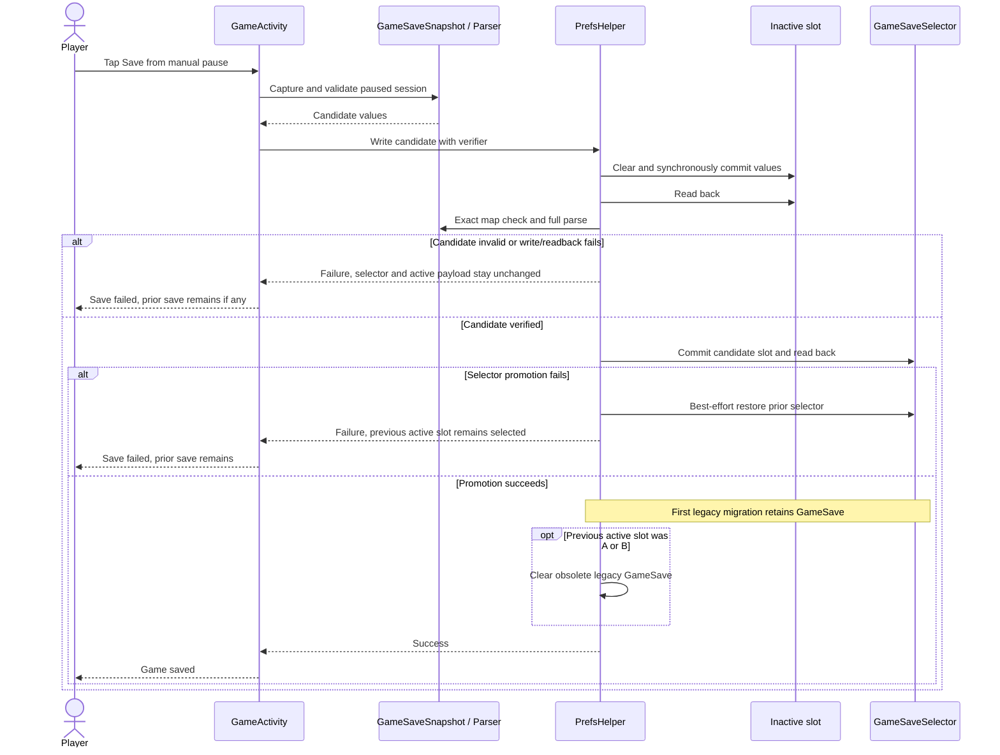
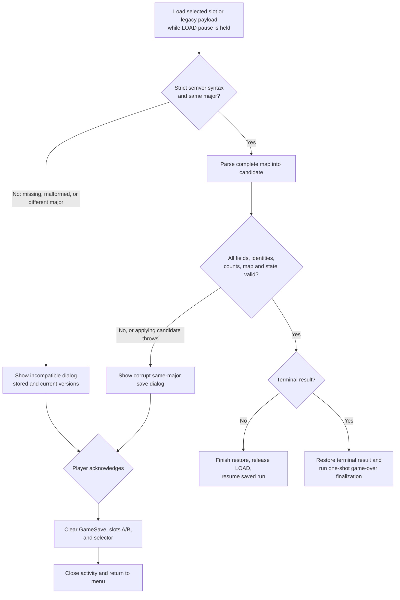
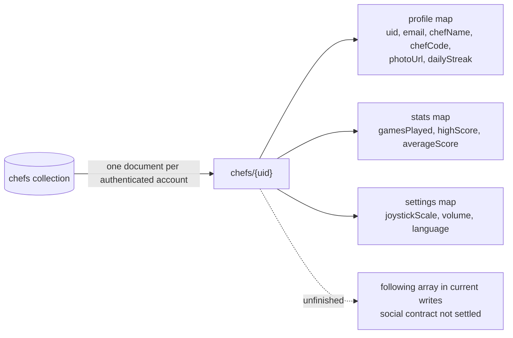
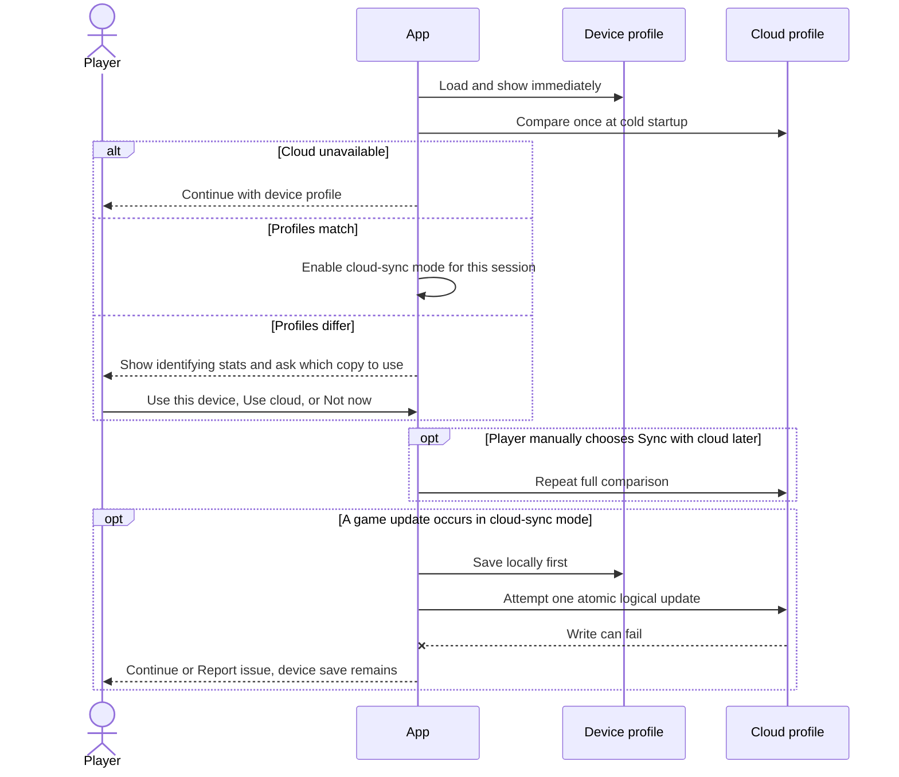

# Persistence and account integration

Purpose: safely modify saves, settings, authentication, or Firebase. For game rules, see [gameplay.md](gameplay.md).

## Local stores

| Store | Owner | Contents |
| --- | --- | --- |
| `chef_prefs` | `PrefsHelper` | volume, joystick scale, language, profile fields, and aggregate stats. |
| `GameSave` | `PrefsHelper` | Compatibility source for a versioned save created before two-slot storage. It is read only when no active two-slot selector exists. |
| `GameSaveSlotA` / `GameSaveSlotB` | `PrefsHelper` | Alternating active and inactive saved-game payloads: player position, score/failures, held item, table items, active orders, and pot states/contents/progress. |
| `GameSaveSelector` | `PrefsHelper` | The small selector naming which verified slot is active. |
| `ProcessManagerPrefs` | `GameManager` | legacy local high score written on game over. |

## Local and cloud boundary

Gameplay and saved runs are device-local. A player can start and complete a game offline and without an account. `GameSave`, both save slots, and their selector are never uploaded as part of profile sync. Preferences and aggregate profile statistics are written locally first; when a Firebase user and sync adapter are available, the current implementation requests asynchronous field-by-field updates to that user's `chefs/{uid}` document. Fetching that document hydrates the local cache with cloud echo suppressed. This is optional, incomplete sync, not a conflict-resolving or atomic profile system; a cloud failure does not undo the local preference write or block gameplay.

## Two-slot save transaction

The manually keyed payload stores the full semantic game version and stable ingredient/recipe identities. `GameVersionPolicy` accepts a syntactically valid `major.minor.patch` version when its major equals the current major; minor and patch differences remain compatible. Missing, malformed, or different-major versions are incompatible. The current app version is `1.0.0`.

Saving is allowed only from the manual pause menu. `GameSaveSnapshot` captures a non-consuming snapshot at the player's last fully reached traversable tile and validates it before storage. `PrefsHelper` alternates between slots. It writes and synchronously reads back the inactive slot, requires an exact map match and a successful full parse, then commits and verifies the selector promotion. A failure before promotion leaves the previous active slot selected. If selector promotion fails, the helper restores the prior in-process selection and best-effort restores the selector on disk. On a first save from the pre-two-slot compatibility store, slot A becomes active while `GameSave` is retained; a later successful promotion between real slots makes that compatibility payload unnecessary and clears it. The UI reports either that the previous save remains available or that no save was created.

Candidate failure never overwrites the selected payload; successful selector promotion is the transaction's commit point. `clearSaveState()` removes `GameSave`, both slots, and the selector.

Save discovery, loading, and clearing must use `PrefsHelper`; see the transaction above for legacy adoption and slot promotion behavior.

## Load decision

Loading holds a session `LOAD` pause before order scheduling and ingredient basket filling can mutate gameplay. `GameVersionPolicy` first checks the strict three-part numeric version syntax and major version. A malformed, missing, or different-major version follows the incompatible-save path. Its blocking dialog names the stored and current full versions; a missing or malformed stored value is displayed as `unknown`. For a compatible version, `GameSaveParser` reads the entire `SharedPreferences.getAll()` map into a candidate and validates field types, counts, stable item/recipe identities, recipes (including `Waste` and dishes with no active matching order), pot consistency/progress, order times, map counts, and a traversable tile before any candidate field is applied. A validation failure or restore-application exception within this compatible major follows the corrupt-save path. The two paths show distinct blocking dialogs. Acknowledging either clears all saved-game stores and returns to the menu; no fresh or partially restored session becomes playable. `LOAD` remains held until acknowledgment on failure. A valid non-terminal candidate releases `LOAD` after application. A valid terminal snapshot restores its score/failure result and enters normal one-shot terminal finalization.

The versioned format remains coupled to table/pot map ordering even though ingredients and recipes now use stable persisted identities. A release that incompatibly adds, removes, or reorders persistent map objects, removes an identity, or changes saved-state semantics must increment the semantic major version; cosmetic skins and compatible presentation changes do not. Basket selection, ingredient-fetch state, and scoring streak state remain intentionally unsaved.

## Firebase / Google sign-in

`AccountManager` uses Android Credential Manager to obtain a Google ID token, authenticates with Firebase Auth, and reads/writes Firestore. Configuration lives in `android/app/google-services.json`; treat it as sensitive configuration and do not copy it into docs.

Expected Firestore document: `chefs/{uid}` with `profile`, `stats`, and `settings` nested maps. The code also sketches social/following functionality, but it is not a complete feature.

Firestore is a NoSQL document database, so this project documents its shape as collections, documents, and nested maps rather than as relational tables:

The diagram describes the document written by profile creation. Some unfinished social queries still look for `chefCode` and `uid` at the document root, and the comments describe `following` as a map while current writes use an array. Treat those mismatches as known defects, not as alternate schema definitions.

`BaseActivity.onCreate()` initializes `PrefsHelper` with the application context and an Activity-free cloud sync adapter. Credential prompts remain owned by the foreground `MainActivity`'s `AccountManager`; the static preference helper does not retain an Activity. Preference and aggregate-stat setters write `chef_prefs` first, then request an asynchronous field update only when a current Firebase user exists. Synchronous adapter failures and asynchronous Firestore task failures produce a bounded diagnostic containing only the exception type. Remote cache hydration suppresses those upload calls, so loading account values is not treated as a user edit. Firebase initialization or sync failure leaves the local guest path available. The current code does not implement the accepted Phase 1 conflict choices, session mode, account-namespaced local profiles, or atomic multi-field updates below.

The initial joystick radio selection is hydrated from the local setting before its user-change listener is installed, in both the menu settings and game settings. Completing a game updates local high score, average score, and games played, then clears the entire saved-run state (`GameSave`, both slots, and selector); the focused unit seam uses a fake local stats store and does not require Firebase. Acknowledging an incompatible or corrupt load also clears all of those stores.

## Accepted Phase 1 sync behavior

[ADR 0006](decisions/0006-session-scoped-cloud-profile-sync.md) defines the replacement for the current unfinished synchronization. At cold startup, the app will show device data immediately, attempt at most one authenticated cloud comparison, and establish either device-only or cloud-sync mode for the remainder of that process session. A differing cloud profile must not overwrite local data without an explicit **Use this device**, **Use cloud**, or **Not now** choice. A signed-in **Sync with cloud** action in the account/profile area may repeat the complete comparison when deliberately requested, including after **Not now** or offline write failures; divergence uses the same explicit source choices. In cloud-sync mode, a logical multi-field update writes locally first and attempts one atomic cloud update; failure retains local data and shows one Continue/Report issue alert. All player-facing copy must say **cloud**, never Firestore, Firebase, database, or another provider name. This is accepted Phase 1 scope and is not implemented by the current field-by-field adapter.

The comparison snapshot will include chef name, high score, games played, and last-updated time. Account level is not currently part of the game/profile model and may be displayed only after a separate level-system decision and implementation. Local account-linked profiles must be namespaced by authenticated account so multiple Google users on one device cannot overwrite one another's cache. Active in-progress games remain device-local.

The accepted future session flow is:

## Change checklist

- Maintain a local-first outcome for settings/gameplay data unless the user explicitly changes the product decision.
- Keep optional Firebase writes asynchronous and signed-out safe; local writes must not depend on cloud task success.
- Test signed-out, no-network, first sign-in, returning sign-in, and failed Firebase requests when changing account code.
- Test device/cloud equality, all three conflict choices, one-automatic-prompt-per-cold-start behavior, manual sync from device-only and cloud-sync modes, manual offline/read/upload failure, account switching, atomic logical updates, retry after a failed cloud write, and one failure alert per logical update.
- Avoid logging identity tokens, UIDs, email addresses, or raw preference dumps.
- Document any schema change here, including migration and rollback behavior.
