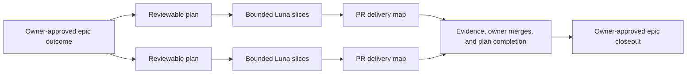

# Cooking Spree — overarching Android roadmap

Status: living. Product direction accepted 2026-09-21. Epic 0 completed with owner approval on 2026-10-05. Epic 1 is the next accepted outcome; its detailed plans and implementation still require owner approval.

## Long-term goal

Cooking Spree should become an approachable, polished Android cooking game for casual players. Its single-player core remains enjoyable without an account or internet. Optional Google cloud profiles and leaderboards add competition, followed by an in-person party cooking mode for people gathered together. The Android release should have cohesive original/licensed artwork and audio and meet an owner-approved definition of completion.

Android is the only active platform. iPhone work starts only after the owner establishes and accepts Android-roadmap completion. Monetisation, currencies, skins, power-ups, remote multiplayer, seasons, and advanced anti-cheat are not current commitments. The authoritative product priorities and boundaries are in [accepted direction](../docs/direction.md) and [ADR 0002](../docs/decisions/0002-offline-first-competition-direction.md).

## Epics and their plans

The roadmap-level outcomes are **epics**: broad results the owner wants to achieve. Each epic is decomposed into one or more reviewable **plans**, and each implementation plan is divided into bounded **Luna slices** with a PR delivery map. Existing `phase-*` filenames and headings remain stable until a dedicated terminology migration; they refer to these epics, not to one agent-sized execution plan.

An epic expresses the broad outcome; plans make independently reviewable commitments; Luna slices are bounded implementation handoffs; and PRs package those slices for evidence and owner review. A plan may need multiple PRs, and an epic closes only after all of its plans close.

Execute the epics in order. Each currently has its own Markdown file; this document owns the overall sequence, summaries, and links.

| Epic and current outline/plan | What should be handled in this stage | Status |
| --- | --- | --- |
| [0 — Baseline recovery](phase-0-baseline-recovery.md) | Restore the build and meaningful tests; make signed-out/offline play safe; fix session/worker/render/input cleanup, pause/tutorial lifecycle, destructive saves, and unsafe legacy loading; gather device evidence. | Complete, evidenced, merged, and owner-approved on 2026-10-05. |
| [1 — Competition](phase-1-competition.md) | Optional Google cloud profile; player-selected local/cloud conflict handling; global all-time leaderboard, then Chef-Code friends ranking; account/schema/sync and backend-rule correctness. | Accepted epic outcome; split into detailed plans for approval before implementation. |
| [2 — Single-player quality](phase-2-single-player-quality.md) | Select and deliver tutorial, save continuity/compatibility, map/device, rendering, and difficulty improvements for a polished offline game. | Accepted outcome; individual improvements require selection; detail when next. |
| [3 — Co-located multiplayer](phase-3-co-located-multiplayer.md) | Define player/device/input/connectivity/rules, then implement and verify an in-person party mode while preserving single-player. | Accepted future outcome; product and technical design undecided. |
| [4 — Release readiness](phase-4-release-readiness.md) | Cohesive licensed/original visuals/audio, credits, privacy/backup decisions, selected publishing requirements, release evidence, and an approved Android completion checklist. | Accepted outcome; release criteria await owner decisions. |

### Roadmap completion checklist

- [x] Phase 0 / Epic 0 — Baseline recovery complete, evidenced, merged, and owner-approved on 2026-10-05.
- [ ] Phase 1 — Competition complete, evidenced, and owner-approved.
- [ ] Phase 2 — Single-player quality complete, evidenced, and owner-approved.
- [ ] Phase 3 — Co-located multiplayer complete, evidenced, and owner-approved.
- [ ] Phase 4 — Release readiness complete, evidenced, and owner-approved.

## Where all the ideas live

- [Idea inbox](../docs/ideas/inbox.md): the preserved, append-only collection of app inspirations, grouped by accounts, competition, quality, multiplayer, customisation, and release. It includes ideas that are deferred or outside the current roadmap.
- [Idea inbox guide](../docs/ideas/README.md): how ideas are captured and promoted into committed work.
- [Original future-plans document](COOKING%20SPREE%20future%20plans.md): the original detailed brainstorming source. Preserve its ideas and wording; checkbox/status annotations may be maintained for progress clarity.

An idea appearing in these documents is not automatically approved work. Only the owner promotes it into an epic by approving its outcome and priority; its detailed plans still require approved scope and acceptance criteria. Keep original wording; mark ideas linked, deferred, or superseded instead of deleting them.

## Planning and execution protocol

Only the next epic should receive detailed implementation plans. Epic 0 is complete; Epic 1 is now next, but its outcome outline does not authorize implementation. Split Epic 1 into small reviewable plans, each with bounded Luna slices, acceptance evidence, and a PR delivery map. Retain later epics as outlines until preceding evidence and owner decisions make their scope concrete.

All maintained plans use task checkboxes for actionable work, verification, gates, and owner approvals. An unchecked box means pending, not approved. Mark a box complete only when its stated result is true and evidence is recorded or linked; owner-approval boxes may be checked only by the owner. Future-epic outcome checklists remain non-authorizing outlines until that epic receives approved detailed plans.

Before implementation begins within an epic, its detailed plan or plans must collectively complete this checklist:

- [ ] Outcome approved by the owner.
- [ ] Scope and exclusions defined.
- [ ] Bounded slices and dependencies defined.
- [ ] PR delivery map defined: each PR has assigned slices, a base/dependency strategy, mergeability, and an explicit ready-for-review gate.
- [ ] Acceptance criteria and verification defined.
- [ ] Documentation owners identified.
- [ ] Relevant ideas and ADRs linked; required material decisions recorded.

A plan may use several PRs. Each PR becomes ready as soon as its assigned scope and evidence are complete; it does not wait for later plans or PRs in the epic. Unless the delivery map identifies a blocker, implementation proceeds to the next PR while the owner reviews the previous one. Independent PRs target the normal integration branch. Dependent work uses a stacked PR whose base is the predecessor branch until that predecessor merges, then is retargeted or rebased so reviewers continue to see only the intended change. Owner review is required for every PR, and agents never merge them.

Material architecture, persistence, online, platform, or product decisions use [decision records](../docs/decisions/README.md). Revisions preserve earlier detail by marking it deferred or superseded rather than silently removing commitments.

Sol/Terra decomposes an epic into reviewable plans and orchestrates them; Luna implements bounded slices; the orchestrator reviews, integrates, verifies, and reports evidence. Follow [agent governance](../docs/decisions/0001-agent-governance-and-delivery.md). Epic 0's completed file demonstrates the Luna handoff and slice gates.

## Verification and completion

Implementation means a plan's changes have been made. Verification means the build, focused tests, review, and relevant device/emulator smoke checks demonstrate that plan's acceptance criteria. Missing required device evidence leaves verification pending.

An epic is complete only when all of its plans meet their criteria, automated and manual evidence is recorded, documentation is current, every PR in their delivery maps has been approved and merged by the owner, and the owner approves epic closeout. Opening or finalizing a PR does not authorize merging. Review the next epic's plans against the actual result before starting implementation.

## Supporting records and repository boundary

- [Repository review](../docs/reports/2026-09-21-repository-review.md): validated defects and limitations that inform phase planning.
- [Development and verification guide](../docs/development.md): commands, device requirements, and smoke checks.
- [Documentation index](../docs/README.md): canonical project documentation navigation.
- [Repository layout decision](../docs/decisions/0004-project-root-repository.md): project-root Git and canonical documentation placement.

The project root is the Git repository; `android/` contains the Android Gradle project, as recorded in [ADR 0005](../docs/decisions/0005-android-project-directory.md). Canonical epic outlines and plan contracts are committed with app code, so PR reviewers can read the complete project context in one repository.
